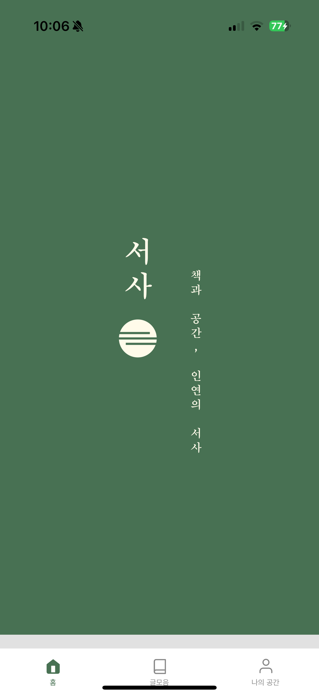
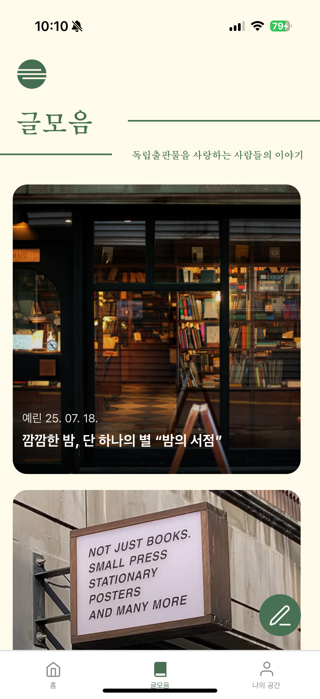
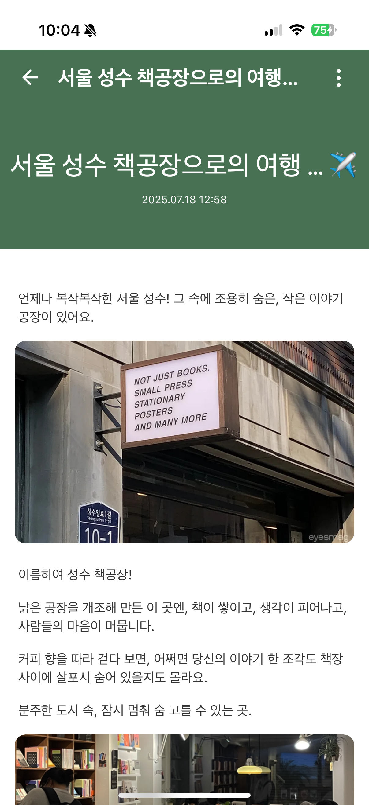
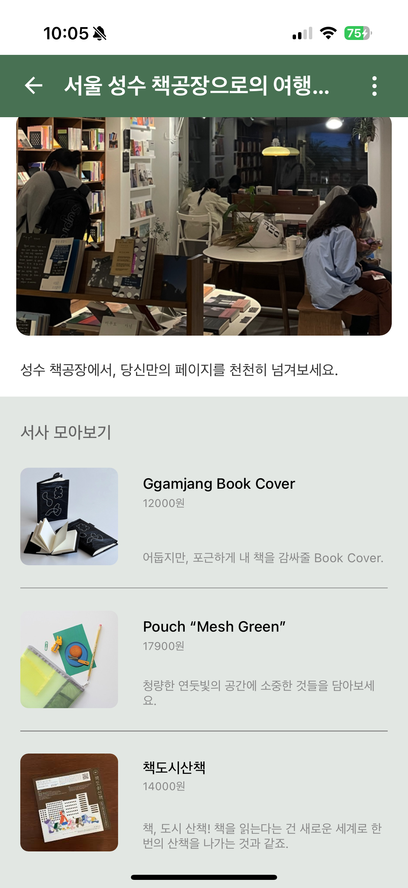

# Seosa (서사)

독립서점 책이음 단기프로젝트 &lt;서사&gt; 클라이언트

동네 독립서점과 이용자를 잇는 커뮤니티 아카이빙 앱입니다. 이용자는 책방에 대한 글을 쓰고 사진·지도 위치를 함께 기록하며, 다른 사람의 글에 북마크·댓글을 남겨 소통할 수 있습니다.

## 📱 스크린샷

<table>
  <tr>
    <td></td>
    <td></td>
    <td></td>
    <td></td>
  </tr>
  <tr>
    <td align="center">홈 화면</td>
    <td align="center">글 모음</td>
    <td align="center">글 상세</td>
    <td align="center">글 상세</td>
  </tr>
</table>

## 📖 프로젝트 소개

- 독립서점 탐방기를 작성·공유하는 React Native(Expo) 기반 모바일 애플리케이션입니다. 카카오 소셜 로그인으로 간편 가입하고, 글 작성 시 사진과 카카오맵 기반 서점 위치를 첨부합니다. 마이페이지에서 내가 쓴 글·북마크·댓글을 모아볼 수 있고, ADMIN/EDITOR 권한 계정은 관리자 전용 화면에서 게시글을 관리할 수 있습니다.
- **플랫폼** : iOS / Android / Web (Expo 단일 코드베이스)
- **백엔드** : `https://seosa.o-r.kr` (별도 서버 레포와 REST API로 연동, JWT 인증)

## 🚀 주요 기능

- **로그인 / 회원가입** : 카카오 소셜 로그인(OAuth2), 로컬 이메일 회원가입, 이메일 인증, 비밀번호 재설정
- **글 작성 / 조회** : 사진 첨부, 카카오맵 기반 서점 위치 첨부, 글 상세·갤러리 보기
- **지도 검색** : 현재 위치 기반 카카오 로컬 API 서점 검색 및 선택
- **마이페이지** : 내가 쓴 글, 북마크 목록, 댓글 목록, 프로필 수정
- **북마크 · 댓글** : 글 북마크 생성/해제, 댓글 작성 및 조회
- **관리자 기능** : ADMIN/EDITOR 권한 계정 전용 게시글 관리 화면
- **딥링크** : `seosa://` 커스텀 스킴으로 로그인 콜백 등 화면 직접 연결
- **FAQ / 약관** : FAQ, 개인정보처리방침, 이용약관 화면

## 🛠 기술 스택 & 라이브러리

| 구분 | 사용 기술 |
| --- | --- |
| Core | React Native 0.81, React 19, Expo SDK 54 |
| 상태 관리 | Redux Toolkit, React Redux |
| 내비게이션 | React Navigation (Native Stack), 커스텀 스킴 딥링크(`seosa://`) |
| 네트워크 | Axios — JWT Access/Refresh 자동 재발급 인터셉터 직접 구현 |
| 인증 | Kakao OAuth2(WebView 기반), 로컬 이메일 회원가입, Expo SecureStore, AsyncStorage |
| 지도 / 위치 | react-native-maps, expo-location, Kakao Local API(장소 검색) |
| 미디어 | expo-image-picker, expo-image-manipulator, expo-camera, AWS S3 Presigned URL 업로드 |
| UI / 에셋 | react-native-svg(+svg-transformer), expo-linear-gradient, 커스텀 폰트(Noto Sans, UnBatang) |
| 배포 | EAS Build / EAS Submit |
| 기타 | expo-clipboard, react-native-webview, expo-auth-session, react-native-dotenv |
